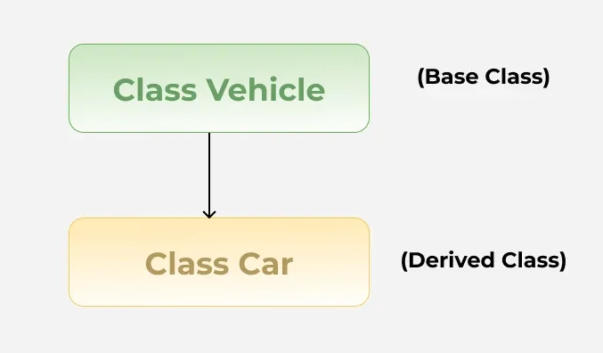
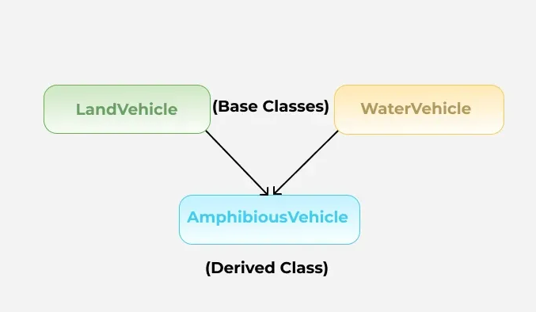
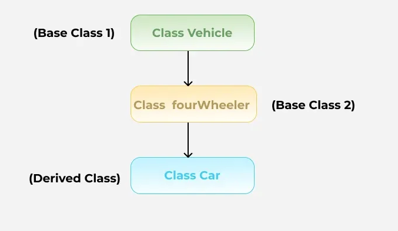
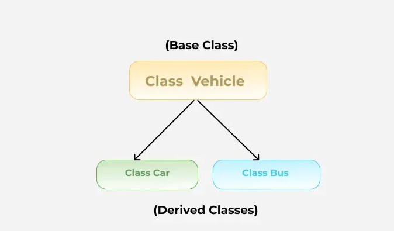
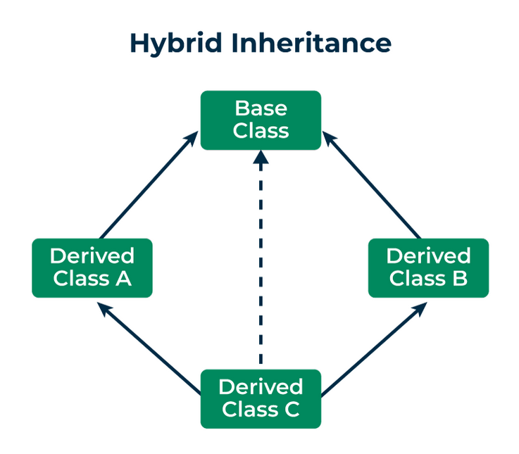
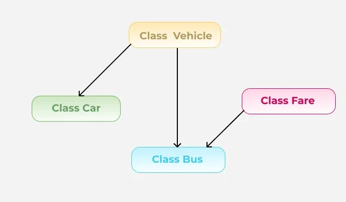
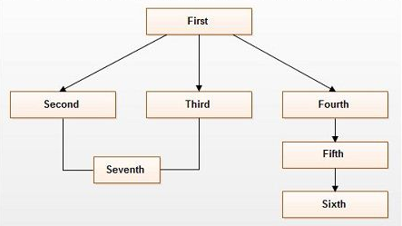
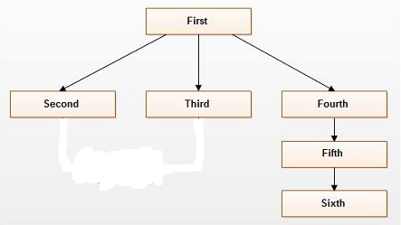

Swift is a multi-paradigm programming language which supports Object Oriented Programming paradigm

# Swift Inheritance

Before talking swift Inheritance let's talk about inheritance first

Inheritance is one of the fundamental concepts of Object Oriented Programming(OOP)

As the name suggest inheritance is about inheriting properties (in this case, not the wealth or money).
In OOP sense, inheritance is about inheriting class properties and methods.

A class can inherit methods, properties, and other characteristics from another class. Inheritance allows us to create a new class from an existing class and reuse the existing code and functionality

### Base Class

The class whose members are inherited to create another class is known as a base class. Base class is also known as parent class or super class.

### Derived class

The new class which is created through inheritance from another class is known as Derived class. Derived class is also known as child class or sub class.

The terms you will hear frequently together (as a pair) is:

- Base Class - Derived Class
- Parent Class - Child Class
- Super Class - Sub Class

But there are some exceptions like in swift, the commonly used pair term is: **Base Class - Sub Class**. Which is no big deal since basically means the same thing.

## Types of Inheritance

Depending on the inheritance mechanism, at the core inheritance is two types:

- Single Inheritance
- Multiple Inheritance

### Single Inheritance

In single inheritance a class (derived or child class) inherits properties and behaviors from only one other class (the base or parent class).

In simple words, when a dervied class have single base class it is called single inheritance.

### Multiple Inheritance

In multiple inheritance a class (derived or child class) inherits properties and behaviors from multiple (more than one) other classes (the base or parent class).

In simple words, when a dervied class have multiple base classes it is called Multiple inheritance.

**C++** supports both single and multiple inheritance, based on that C++ supports following inheritance

- Single Inheritance
- Multiple Inheritance
- Multilevel Inheritance
- Hierarchical Inheritance
- Hybrid Inheritance

### Single Inheritance

When a derived class in only allowed to have only one base class then it is called single inheritance.

### Multiple Inheritance

When a derived class in only allowed to have more than one base class then it is called multiple inheritance.

### Multilevel Inheritance

When a derived class is created from another derived class then it is called multi-level inheritance.

### Hierarchical Inheritance

When multiple derived classes are created from single base class then it is called Hierarchical Inheritance.

### Hybrid Inheritance

When more than one type of inheritance involved in a inheritance relation then it is called Hybrid Inheritance.

There is no specific requirement for Hybrid Inheritance. Any two or more type of inheritance create Hybrid Inheritance.

### But Unlike C++, Swift only supports single inheritance, based on that Swift supports following inheritance

- Single Inheritance
- Multilevel Inheritance
- Hierarchical Inheritance
- Hybrid Inheritance (which does not include class level multiple inheritance)

## Single Inheritance

When a derived class in only allowed to have only one base class then it is called single inheritance.

## Multilevel Inheritance

When a derived class is created from another derived class then it is called multi-level inheritance.

## Hierarchical Inheritance

When multiple derived classes are created from single base class then it is called Hierarchical Inheritance.

## Hybrid Inheritance (which does not include multiple inheritance)

When more than one type of inheritance involved in a inheritance relation then it is called Hybrid Inheritance. But in case of swift Hybrid Inheritance does not contain multiple inheritance since it does not support multiple inheritance by default.

# Important Question about Swift Inheritance

Now, a question can arise, Why swift does not support class level multiple inheritance?

For answer that question, let's look at hybrid inheritance of C++.

Here,

- Second is inheriting First
- Third is inheriting First
- And Seven is inheriting both Second and Third

But, if you look closely you can see, both Second and Third contains all properties of First. In seventh case it will be inheriting twice of First's properties. Seventh will face property duplication issue. This problem is also known as diamond problem. C++ has it's own virtual keyword to deal with it. But swift did not wanted to face this trouble at all.

Since, Swift supports Multiple Inheritance through protocols.

---

Now, another question can arise, Is supporting multiple inheritance through protocols can result into base class property duplication or diamond problem?

The short answer is No.

Now, Why is that?
Diamond problem only occurs when in multiple inheritance, derived classes works as base classes. for reference let's look at the picture again.

Here, Second and Third both are derived classes but acting as base classes for Seventh

Which is not possible in protocol scenario.
