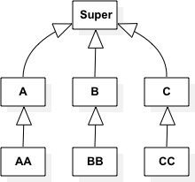
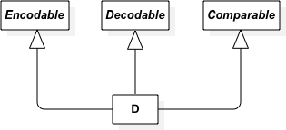

# Protocol Oriented Programming

## Swift - the First POP Language

At WWDC 2015, Apple announced that Swift is the world’s first Protocol-Oriented Programming (POP) language.

## So, what is Protocol-Oriented Programming (POP)?

Protocol-Oriented Programming is a new programming paradigm ushered in by Swift 2.0. In the Protocol-Oriented approach, we start designing our system by defining protocols.

We rely on new concepts:

        - Protocol Extension
        - Protocol Inheritance
        - Protocol Compositions

In Swift, value types are preferred over reference types (which are classes). However, Object-Oriented concepts don’t work well with structs and enums. Because a struct can not inherit from another struct, and an enum can not inherit from another enum.

So, inheritance, which is a fundamental concept of Object-Oriented Programming, can not be applied to value types. But we learned earlier that value types can inherit from protocols.

Therefore, value types are now the preferred type of Protocol-Oriented Programming.

## Start with a Protocol

When designing a software system, we try to identify the elements needed to satisfy the requirements of a given system. We then model the relationships between these elements.

There is two ways to do that.

- Start with a superclass and model its relationships through inheritance
- Start with a protocol and model the relationship as a protocol implementation.

However, Apple tells us:

                “Don’t start with a class, start with a protocol.”

## But Why?

Because protocols serve as better abstractions than classes.



If you model an abstraction using classes, you’ll need to rely on inheritance. The superclass defines the core functionality and exposes it to subclasses. A subclass can completely override that behavior, add specific behavior, or get all the work done by the superclass. This works nicely until you realize that you need more functionality from a different class. Swift, just like many other programming languages, does not support multiple inheritance. Following the class-first approach, you’d have to keep adding new functionality to your superclass or otherwise create new intermediary classes, thereby complicating the issue.

Protocols, on the other hand, serve as blueprints rather than parents. A protocol models abstraction by describing what the implementation types shall implement.

For example, the following protocol:

```swift
protocol Entity {
        var name: String {get set}
        static func uid() -> String
}
```

What it tells us is that adopters of this protocol will be able to create an entity, assign it a name, and generate its unique identifier by implementing the type method uid().



One type can model multiple abstractions, since any type - including value types - can implement multiple protocols.

This is a huge benefit over class inheritance. You can separate the concerns by creating as many protocols and protocol extensions as needed.

Say good-bye to monolithic superclasses! The only caveat is that protocols define a template abstractly -- with no implementation. Here’s where protocol extensions come to the rescue.

# The Pillars of Protocol-Oriented Programming(POP)

- Protocol Extensions
- Protocol Inheritance
- Protocol Composition
